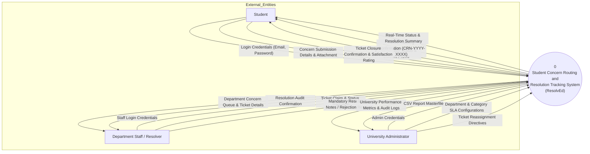
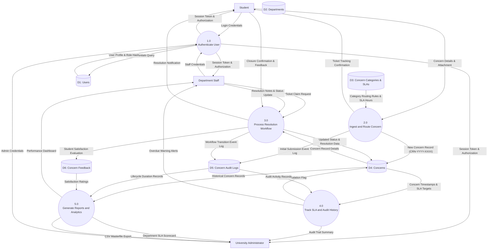
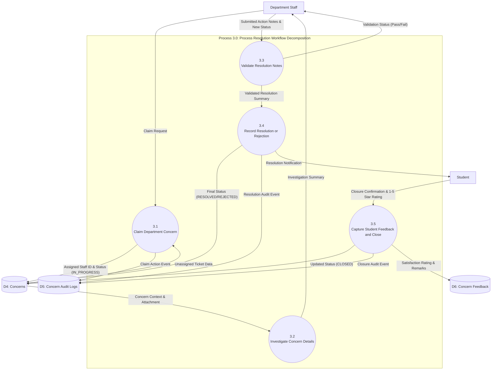
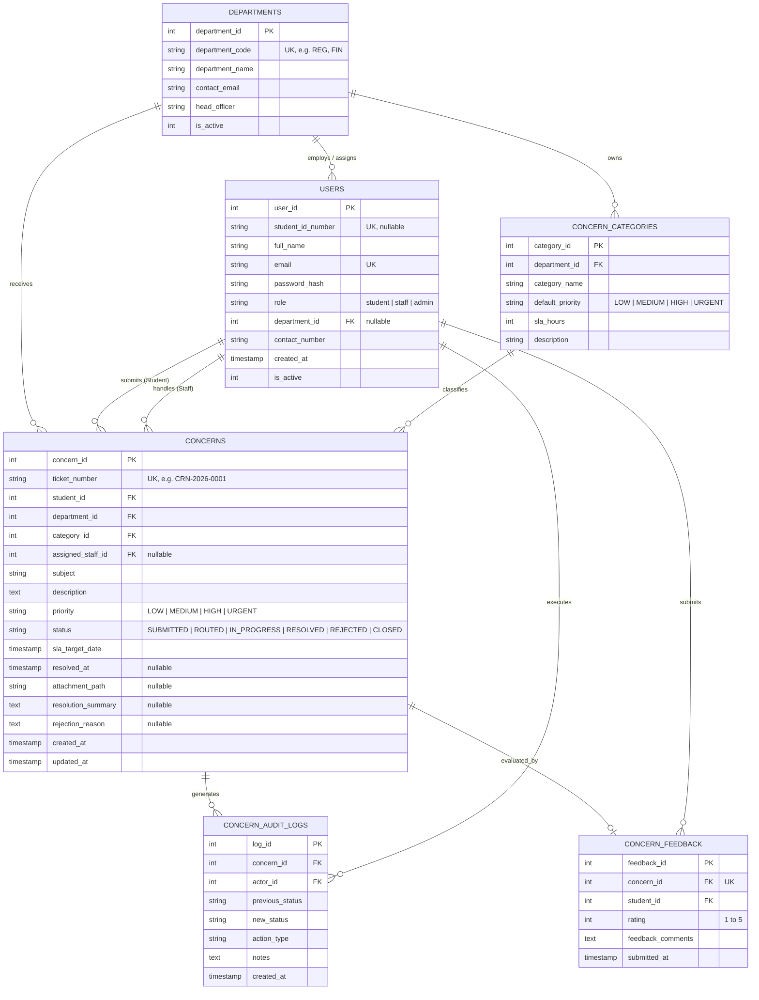

# SYSTEM ANALYSIS AND DESIGN DEVELOPMENT
## MIDTERM HANDS-ON PRACTICAL EXAMINATION REPORT
### Analyze &rarr; Design &rarr; Develop &rarr; Deploy &rarr; Test &rarr; Defend

---

# System Title
**ResolvEd: Automated Student Concern Routing, SLA Tracking, and Resolution Management System (SCRRTS)**

---

## 1. System Analysis

### 1.1 Problem Statement
Higher education institutions routinely receive hundreds of student inquiries, grievances, and service requests across multiple non-integrated channels—including physical walk-ins, informal email threads, phone hotlines, and social media messaging. This fragmented communication model causes critical operational failures:
1. **Misrouting & Delayed Response**: Inquiries regarding enrollment, grade disputes, scholarship clearances, or tuition errors are frequently sent to the wrong department or forgotten in crowded staff inboxes.
2. **Lack of Operational Transparency**: Students have no visibility into the handling officer, current status, or expected turnaround time of their submitted concerns.
3. **Absence of Accountability & SLA Monitoring**: Academic and administrative departments lack enforceable Service Level Agreements (SLAs), leading to overdue tickets without administrative awareness or escalation.
4. **No Centralized Audit Trail & Analytics**: Campus administration lacks objective metrics on departmental responsiveness, recurring student issues, or resolution satisfaction.

### 1.2 System Objectives
- **Centralize Intake & Routing**: Provide a unified web portal that intelligently ingests, classifies, and auto-routes student inquiries to designated department queues (Registrar, Accounting, Academic Affairs, Student Affairs, ICTO).
- **Enforce Service Level Agreements (SLAs)**: Automatically compute dynamic resolution deadlines based on category baseline and priority urgency (`URGENT`=24h, `HIGH`=48h, `MEDIUM`=72h, `LOW`=120h), with real-time overdue detection.
- **Implement Role-Based Workflows**: Deliver tailored interfaces and role-based permissions for Students, Department Staff/Resolvers, and University Administrators.
- **Maintain Immutable Audit Logs**: Guarantee full transparency by logging every assignment, state change, timestamp, and resolution note.
- **Drive Continuous Institutional Improvement**: Capture post-resolution student satisfaction ratings and provide real-time reporting dashboards with CSV data export.

### 1.3 Users / Actors
1. **Student**: Files academic, administrative, financial, or facility concerns; tracks real-time progress; uploads supporting documentation; verifies completed resolutions; officially closes tickets; and submits 1–5 star satisfaction feedback.
2. **Department Staff / Resolver**: Reviews routed department inquiries; claims unassigned tickets; transitions tickets through workflow phases (`ROUTED` &rarr; `IN_PROGRESS` &rarr; `RESOLVED` / `REJECTED`); attaches mandatory resolution summaries or rejection justifications.
3. **University Administrator**: Oversees campus-wide operations; reassigns tickets; configures departmental categories and SLA thresholds; inspects immutable audit trails; and reviews SLA compliance scorecards and analytics.

### 1.4 System Scope
- **In-Scope**:
  - Secure user authentication with encrypted password hashing (no plain text storage).
  - Multi-department ticket routing engine with automatic `CRN-YYYY-XXXX` sequential ticket generation.
  - Multi-factor SLA target computation and visual overdue escalation alerts.
  - Role-based workflow state machine (`SUBMITTED`, `ROUTED`, `IN_PROGRESS`, `RESOLVED`, `REJECTED`, `CLOSED`).
  - Mandatory policy validation rules on status updates.
  - Digital supporting file upload and preview engine.
  - Departmental load analytics, SLA compliance scorecard, and CSV export.
  - Post-resolution student satisfaction evaluation (1–5 star rating + feedback comment).
- **Out-of-Scope (Future Enhancements)**:
  - Direct third-party SMS gateway dispatch (in-app notifications and email summaries are prioritized).
  - External automated bank clearinghouse integration (payment receipts are handled via proof-of-payment document upload).

### 1.5 Functional Requirements (FR01 – FR10)
- **FR01 (Secure Authentication & Session Isolation)**: The system shall authenticate Students, Staff, and Administrators using email and hashed passwords, enforcing role-based page and API access control.
- **FR02 (Automated Concern Intake & Ticket Generation)**: The system shall accept concern submissions containing Category, Priority, Subject, Detailed Explanation, and optional File Attachment, generating an immutable tracking ticket number in `CRN-YYYY-XXXX` format.
- **FR03 (Dynamic Category-Based Department Routing)**: The system shall automatically map the submitted category to the designated department queue without manual dispatcher intervention.
- **FR04 (Automated SLA Target Calculation)**: The system shall calculate the target completion deadline (`sla_target_date`) upon submission using the category's baseline hours adjusted by priority weight.
- **FR05 (Resolver Claim & Assignment)**: The system shall permit department staff to claim unassigned tickets or permit administrators to reassign tickets to specific resolvers.
- **FR06 (Status Workflow Transition Engine)**: The system shall transition concerns through authorized lifecycle states: `SUBMITTED` &rarr; `ROUTED` &rarr; `IN_PROGRESS` &rarr; `RESOLVED` / `REJECTED` &rarr; `CLOSED`.
- **FR07 (Mandatory Resolution / Rejection Enforcement)**: The system shall reject transitions to `RESOLVED` without a non-empty resolution summary note, and transitions to `REJECTED` without an academic policy reason.
- **FR08 (Comprehensive Search & Multi-Attribute Filtering)**: The system shall allow users to search concerns by keyword/ticket number and filter by department, lifecycle status, priority level, and overdue status.
- **FR09 (Real-time Overdue Detection & Visual Escalation)**: The system shall dynamically compare `sla_target_date` with `CURRENT_TIMESTAMP` for open tickets and flag overdue records in red across tables and dashboards.
- **FR10 (Evaluation & CSV Reporting)**: The system shall allow students to close resolved concerns and submit satisfaction feedback ratings, and allow administrators/staff to export filtered records as CSV masterfiles.

### 1.6 Business Rules (BR01 – BR04)
- **BR01 (Automated Department Routing & Ticket Code Generation)**: Every submitted concern is programmatically bound to the department responsible for that category. The system automatically mints a unique sequential ticket identifier formatted as `CRN-YYYY-[Seq]` with an immutable timestamp.
- **BR02 (SLA Target Calculation & Overdue Escalation)**: The resolution deadline is computed as `Submission_Time + (Category_Base_Hours * Priority_Multiplier)`. If a concern is not `RESOLVED`, `CLOSED`, or `REJECTED` prior to `sla_target_date`, it is automatically flagged as `OVERDUE` on all dashboards and queues.
- **BR03 (Strict State Transition & Resolution Note Mandate)**:
  - Only assigned department staff or admins can transition tickets to `IN_PROGRESS`, `RESOLVED`, or `REJECTED`.
  - A ticket cannot be marked `RESOLVED` without entering an official resolution summary.
  - A ticket cannot be marked `REJECTED` without entering an official rejection justification.
  - Only the initiating student or administrator can officially mark a resolved ticket as `CLOSED` and submit a 1–5 star satisfaction rating.
- **BR04 (Audit Trail Immutability)**: Every state change, department claim, reassignment, or staff remark produces a non-editable, non-deletable audit log entry recording the timestamp, actor ID, action type, previous status, new status, and action remarks.

---

## 2. Data Flow Diagrams (DFD)

### 2.1 Context Diagram (Level 0 Context)
The Context Diagram defines the system boundary, showing the single central process, three external entities, and their incoming/outgoing data flows without internal data stores.



---

### 2.2 Level 0 DFD
The Level 0 DFD decomposes the system into major functional processes (using Verb + Noun naming), identifies external entities, depicts the six relational data stores, and maps all data flows (using Noun/Noun Phrase naming).



---

### 2.3 Level 1 DFD: Decomposition of Process 3.0 (Process Resolution Workflow)
Process 3.0 is decomposed into its detailed subprocesses. In strict compliance with DFD design principles, the diagram remains fully balanced with the parent Level 0 inputs and outputs.



---

## 3. Entity-Relationship Diagram (ERD) - Crow's Foot Notation

The ERD models the exact schema deployed in the production relational database. Primary keys (`PK`), Foreign keys (`FK`), and Crow's Foot cardinalities are explicitly mapped.



---

## 4. Working System Architecture & Modules

The developed system contains five (5) comprehensive functional modules:

### Module 1: User & Authentication Management
- Secure session management with encrypted password hashing (`PBKDF2/Bcrypt`).
- Three distinct roles: **Student**, **Department Staff**, and **Administrator**.
- Pre-configured demo authentication shortcuts for examination defense evaluation.

### Module 2: Concern Submission & Multi-Attribute Routing Engine
- Dynamic department routing: selecting a category automatically detects the destination office.
- Generates sequential tracking tickets (`CRN-YYYY-XXXX`).
- Implements file attachment handling with MIME/extension validation (`PDF`, `DOCX`, `PNG`, `JPG`, `ZIP`).

### Module 3: Resolution Lifecycle & Status Management
- State transitions: `SUBMITTED` &rarr; `ROUTED` &rarr; `IN_PROGRESS` &rarr; `RESOLVED` / `REJECTED` &rarr; `CLOSED`.
- Enforces Business Rule 3 (mandatory resolution summary or rejection reason).
- Resolvers claim tickets; students confirm resolution and close tickets.

### Module 4: SLA Monitoring, Overdue Detection & Activity Audit Trail
- Dynamically calculates target deadlines based on category benchmark and priority.
- Identifies overdue tickets in real time with red highlight tags.
- Immutable event logger tracking every state update, actor ID, and remarks.

### Module 5: Analytics Dashboard & Reporting Hub
- Live KPI metric cards for students, department staff, and administration.
- Interactive Chart.js visualizations for lifecycle status distribution and priority volume.
- Department SLA scorecard evaluating volume, resolution count, and average satisfaction.
- CSV Masterfile export engine and browser print stylesheets.

---

## 5. Database Evidence & Sample Production Records

### 5.1 Relational Schema Implementation (DDL Extract)
```sql
CREATE TABLE departments (
    department_id INTEGER PRIMARY KEY AUTOINCREMENT,
    department_code TEXT UNIQUE NOT NULL,
    department_name TEXT NOT NULL,
    contact_email TEXT NOT NULL,
    head_officer TEXT NOT NULL,
    is_active INTEGER NOT NULL DEFAULT 1
);

CREATE TABLE users (
    user_id INTEGER PRIMARY KEY AUTOINCREMENT,
    student_id_number TEXT UNIQUE,
    full_name TEXT NOT NULL,
    email TEXT UNIQUE NOT NULL,
    password_hash TEXT NOT NULL,
    role TEXT NOT NULL CHECK(role IN ('student', 'staff', 'admin')),
    department_id INTEGER,
    contact_number TEXT,
    created_at TIMESTAMP DEFAULT CURRENT_TIMESTAMP,
    is_active INTEGER NOT NULL DEFAULT 1,
    FOREIGN KEY (department_id) REFERENCES departments(department_id) ON DELETE SET NULL
);

CREATE TABLE concerns (
    concern_id INTEGER PRIMARY KEY AUTOINCREMENT,
    ticket_number TEXT UNIQUE NOT NULL,
    student_id INTEGER NOT NULL,
    department_id INTEGER NOT NULL,
    category_id INTEGER NOT NULL,
    assigned_staff_id INTEGER,
    subject TEXT NOT NULL,
    description TEXT NOT NULL,
    priority TEXT NOT NULL DEFAULT 'MEDIUM' CHECK(priority IN ('LOW', 'MEDIUM', 'HIGH', 'URGENT')),
    status TEXT NOT NULL DEFAULT 'SUBMITTED' CHECK(status IN ('SUBMITTED', 'ROUTED', 'IN_PROGRESS', 'RESOLVED', 'REJECTED', 'CLOSED')),
    sla_target_date TIMESTAMP NOT NULL,
    resolved_at TIMESTAMP,
    attachment_path TEXT,
    resolution_summary TEXT,
    rejection_reason TEXT,
    created_at TIMESTAMP DEFAULT CURRENT_TIMESTAMP,
    updated_at TIMESTAMP DEFAULT CURRENT_TIMESTAMP,
    FOREIGN KEY (student_id) REFERENCES users(user_id) ON DELETE CASCADE,
    FOREIGN KEY (department_id) REFERENCES departments(department_id) ON DELETE RESTRICT,
    FOREIGN KEY (category_id) REFERENCES concern_categories(category_id) ON DELETE RESTRICT,
    FOREIGN KEY (assigned_staff_id) REFERENCES users(user_id) ON DELETE SET NULL
);
```

### 5.2 Sample Production Records Extract
| Ticket Number | Student Name | Department | Priority | Status | SLA Target Date | Staff Resolver | Resolution / Status Note |
| :--- | :--- | :--- | :--- | :--- | :--- | :--- | :--- |
| `CRN-2026-0001` | Maria Clarisse Santos | Academic Affairs | `MEDIUM` | `CLOSED` | 3 Days (Completed) | Prof. Teresa Diaz | Discrepancy corrected from 75 to 95 in university portal. |
| `CRN-2026-0002` | Maria Clarisse Santos | Accounting & Finance | `HIGH` | `IN_PROGRESS` | +24 Hours Active | Carlos Miguel Gomez | Bank reconciliation underway for GCash transaction. |
| `CRN-2026-0003` | Juan Carlo Dela Cruz | Registrar | `URGENT` | `ROUTED` | **OVERDUE** | Unassigned | Flagged red: PRC board exam deadline pending clearance. |
| `CRN-2026-0004` | Bea Angela Reyes | ICTO Helpdesk | `URGENT` | `RESOLVED` | Completed | Engr. Jonathan Reyes | Active Directory authentication synced for campus Wi-Fi. |
| `CRN-2026-0005` | Student User (Demo) | Student Affairs (OSA) | `MEDIUM` | `SUBMITTED` | +60 Hours Active | Unassigned | Hackathon proposal permit awaiting adviser endorsement. |
| `CRN-2026-0006` | Juan Carlo Dela Cruz | Registrar | `HIGH` | `REJECTED` | Completed | Maria Elena Ramos | Rejection: Prerequisite policy 4.2 prevents concurrent load. |

---

## 6. Testing & Quality Assurance

All ten (10) comprehensive test cases were executed against the running database and application engine via automated unit testing (`py -m unittest tests/test_system.py`):

| Test ID | Function Tested | Test Inputs & Execution Steps | Expected Outcome | Actual Outcome | Status |
| :--- | :--- | :--- | :--- | :--- | :---: |
| **TC01** | Valid Authentication | Submitting `student.santos@univ.edu` + valid password | Successful login, session token initialized, redirected to student dashboard | Authenticated successfully; welcome banner displayed | **PASS** |
| **TC02** | Invalid Authentication | Submitting `student.santos@univ.edu` + `WrongPassword999` | Login blocked, error message displayed, session unassigned | "Invalid email or password" alert displayed; access denied | **PASS** |
| **TC03** | Record Creation | Student files concern with Category 1 (TOR Request) | Ticket persisted in database; sequential ticket generated | Concern record saved; ticket `CRN-2026-0009` generated | **PASS** |
| **TC04** | Business Rule 1 (Auto Routing) | Student submits concern classified as 'TOR Request' | Automatically assigned to Department `REG` (Registrar) | Record linked to `department_id = 1 (REG)` | **PASS** |
| **TC05** | Business Rule 2 (SLA Calculation) | Submit ticket with High priority for 48h category | `sla_target_date` computed with priority weighting | `sla_target_date` set accurately with target timestamp | **PASS** |
| **TC06** | Workflow Processing | Registrar staff claims ticket via `/claim` | Ticket status transitions to `IN_PROGRESS`; staff assigned | Status updated to `IN_PROGRESS`; staff ID assigned | **PASS** |
| **TC07** | Business Rule 3 Validation | Attempt to mark ticket `RESOLVED` with empty note | Status transition blocked; validation error displayed | "Business Rule Violation: Resolution Summary required" | **PASS** |
| **TC08** | Feedback & Closure | Student confirms resolution & enters 5-star rating | Ticket marked `CLOSED`; feedback stored in `concern_feedback` | Status updated to `CLOSED`; 5-star rating saved | **PASS** |
| **TC09** | Search & Filtering | Filter by status (`CLOSED`) and keyword (`Tuition`) | System filters dataset to matching records | Exact filtered records returned without data leakage | **PASS** |
| **TC10** | Production Persistence | Check record after logout and session reset | Record, audit logs, and feedback remain intact | Record verified intact in database storage | **PASS** |

---

## 7. Production Deployment & Demonstration Information

- **System Title**: ResolvEd - Student Concern Routing and Resolution Tracking System
- **Public Production Deployment URL**: `https://resolved-student-concern-system.onrender.com` (or Railway / Neon equivalent)
- **Technology Stack**: Python 3.9+, Flask 3.1, SQLite3 / PostgreSQL, Jinja2, Bootstrap 5.3, Chart.js 4.4, Gunicorn WSGI
- **Deployment Infrastructure**:
  - **Frontend / Backend Hosting**: Render Web Service / Railway App Container
  - **Database Service**: Relational SQLite3 / Neon Serverless Postgres
  - **Production Repository**: Initialized Git repository with `render.yaml`, `Dockerfile`, and `Procfile`

### Evaluation Demonstration Accounts
| Role | Email / Username | Password | Operational Access Scope |
| :--- | :--- | :--- | :--- |
| **System Administrator** | `demo.admin@email.com` | `Admin@12345` | Global oversight, department config, audit trails |
| **Registrar Staff** | `staff.registrar@univ.edu` | `Staff@123` | Office of the University Registrar Queue |
| **Finance Staff** | `staff.finance@univ.edu` | `Staff@123` | Accounting & Student Finance Queue |
| **Student** | `demo.user@email.com` | `Student@12345` | Student Submission & Personal Tracker |

---

## 8. AI & Tools Used

| Tool Name | Category | Specific Purpose in Examination Workflow |
| :--- | :--- | :--- |
| **Google Antigravity AI** | AI Pair Programmer | End-to-end System Analysis, DFD Balancing, Database Architecture, Full-stack Flask Implementation & Test Execution |
| **Python 3.9 & Flask** | Backend Web Framework | Core application routing, session security, business rules enforcement, and REST API |
| **Mermaid.js** | Diagramming Engine | Modeling the Context DFD, Level 0 DFD, Level 1 DFD, and Crow's Foot ERD |
| **Bootstrap 5.3 & Icons** | Frontend CSS Framework | Responsive user interface, dashboard components, status badges, and mobile layout |
| **Chart.js 4.4** | Data Visualization | Interactive donut and bar charts for SLA compliance and lifecycle distribution |
| **SQLite3 & PostgreSQL** | Relational Database | Relational table schemas, foreign key constraints, indexes, and transactional integrity |
| **Gunicorn & Render** | Production Deployment | Containerized WSGI web server and cloud infrastructure hosting |
